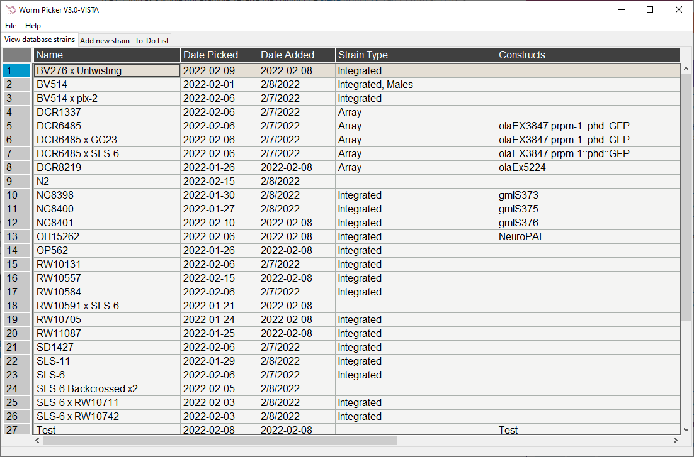
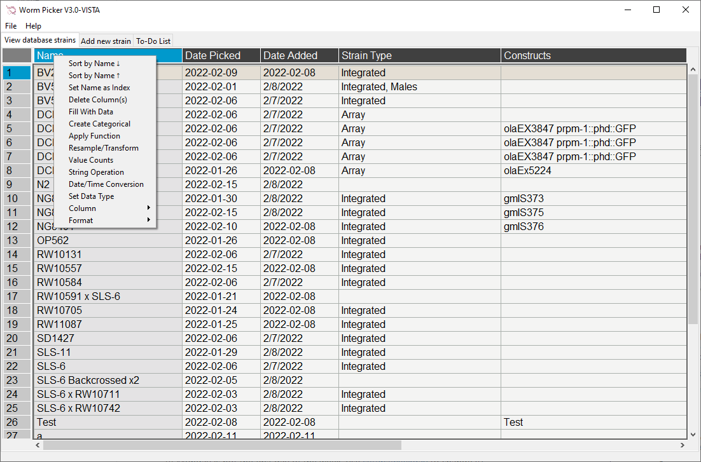
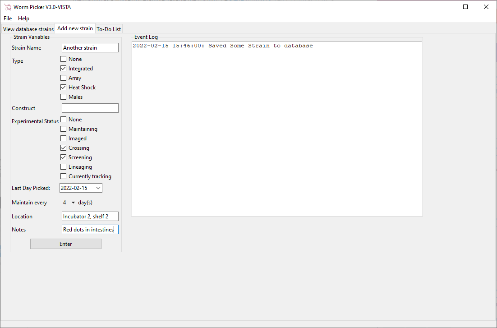
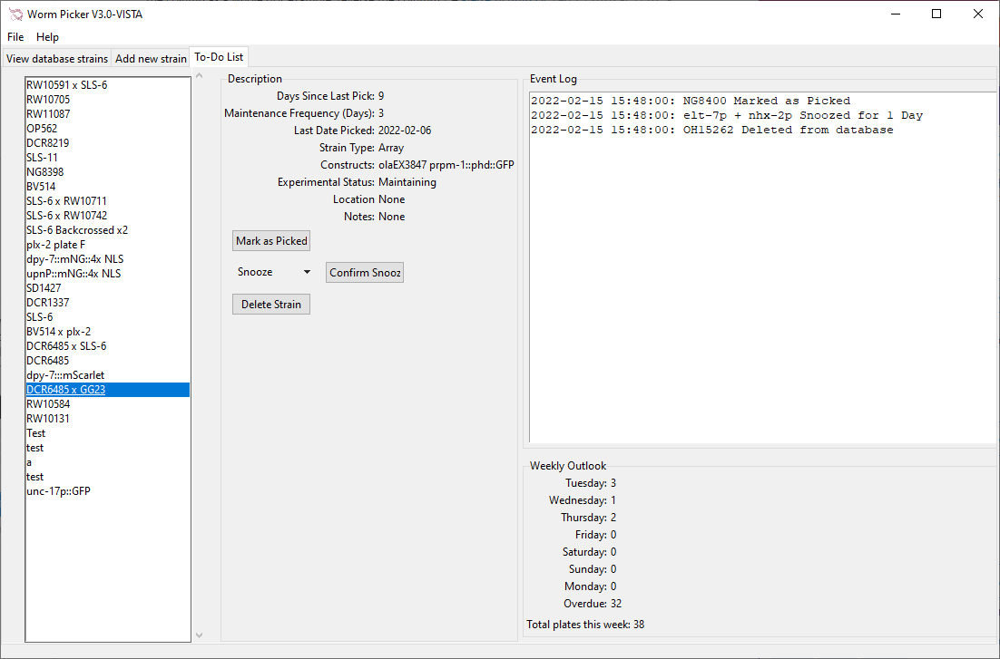
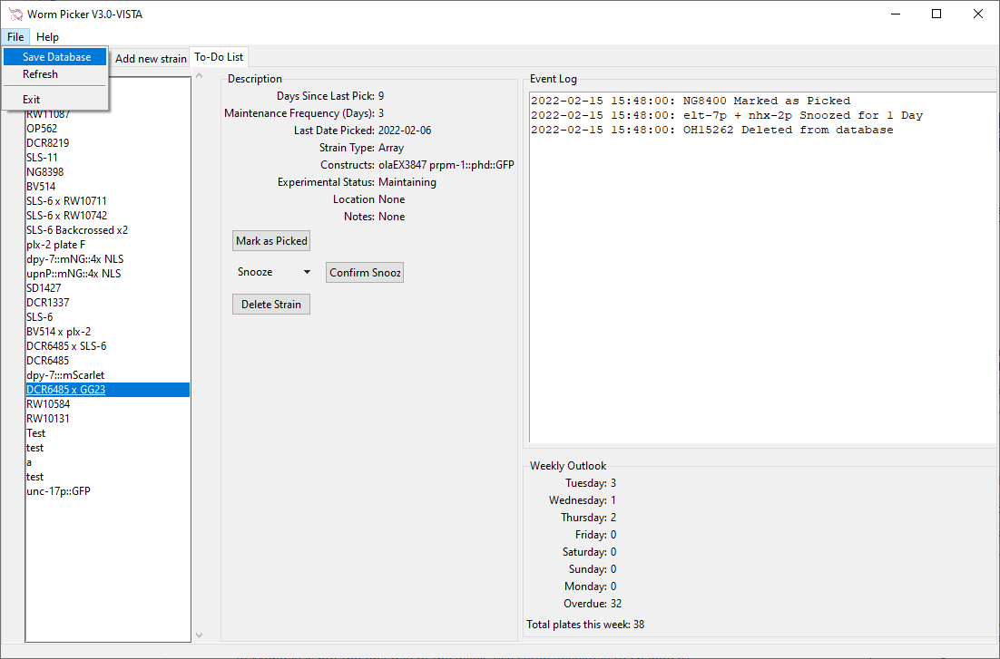

# Worm Picker
A simple app designed for experimental element organization in C. elegans labs. Originally designed for Shroff Lab at NIH/NIBIB
Optimized for Windows Operating Systems. 

worm-notifications.py will NOT run on a non-Windows system. 

____________________________________________________________
## What is a worm-picker?

Worm picker is a simple desktop app built on Python's tkinter module. This app allows the user to keep track of thousands of C. elegans experimental strains. Capabilities include: 
1. Adding strains to your database
2. Viewing acute status and information on current strains
3. Determining daily and weekly tasks pertaining to maintenance
4. Notifying users and their team about daily strains to pick, maintain, or experiment

## Installation

### Modules

**wormpicker.py:**

- os (Pre-installed with python)

- tkinter (Pre-installed with python)

- datetime (Pre-installed with python)

- csv

- pandastable

- pandas (Pre-installed with python) 

- tkcalendar 

**worm-notifications**

- pause

- plyer

To install modules: 
1. Navigate to command line (Powershell/Anaconda Prompt on windows or Terminal on Mac OSX)

2. Run: `pip install [module name here]`

____________________________________________________________
## Usage

To use this package, 

1.	Open the Wormpicker program (wormPickerV2.1.py)
	
    a.	Navigate to the local directory and run `python wormPickerV2.1.py`
    
2.	To use the notification app,
    a.	`pythonw.exe .\worm-notifications.py`
    

### View Database Strains

- Click on the 'View database strains' tab to navigate to the view page. This page utilizes PandasTable, a pandas GUI that works similarly to Excel. 

### Right-click to utilize Excel-style options

- PandasTable allows the user to mutate columns and rows, allows for background highlights, colors, and much more.
- Sorting is a useful tool in this package. To sort a column, simply right-click the column header and select an option from the dropdown box. 
- Personal preferences such as font and font size can also be set by right-clicking on any cell. 
- Note that while there is full functionality behind all right-click options, packages like plotting are not useful.

____________________________________________________________

### Add Database Strains

- Adding strains to the database is easy! Simply enter necessary information into each textbox or dropdown menu. 
- Not all entry forms are necessary - only the name of the strain. 
- Information such as maintenance frequency (How often a given strain should be re-plated to prevent starvation), status, notes, etc. can be specified here or changed later in the view tab.
- The event log on the right hand side will confirm the addition of a strain, noting the time and strain name.  
### View your team's to-do list

- The to-do list gives users and their team a simple interface to keep track of daily and weekly tasks. 
- Using the left column, the user can browse through a list of strains that are in need of maintenance. Only those strains that are ready to be picked will appear here. 
- Strains in the left column are sorted in descending fashion with those that are in most need of attention coming first. Strains that are very old (starved for >30 days) come last in the list, but still appear. 
- The center column lists unique information on each strain. From here, the user may mark the strain under three options:
	1. Picked
	2. Snoozed
	3. Deleted
- All three of these options will remove the strain from the to-do list, though the third option will remove the strain permanently from the database. 
- If a strain is picked or snoozed, the user will not be reminded to maintain the strain until the strain is ready to be maintained again or until the specified number of days snoozed has passed. 
### Other Notes

#### Use the menubar!

- While actions done through the Add tab and To-do list tab will automatically save the database, changes that are made through the view window will not be saved. As such, manual saving is available through the menubar under 'File'. 
	- Here, users may save their data or exit the app. 
	- The refresh button will reset all remind dates so that they correspond to the last day picked and the listed maintenance frequency for each strain. Consequently, if a strain is snoozed, then the data is refreshed, then the strain will no longer be snoozed. 
- The 'Help' section of the menubar offers information such as 'About' and 'How to', which elaborates on the purpose and usage of Worm picker. 

Please send questions, feedback or correspondence to matthew.chaw@nih.gov. 

	
	

	

